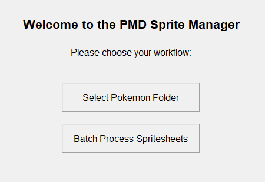
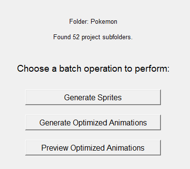
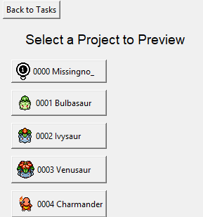
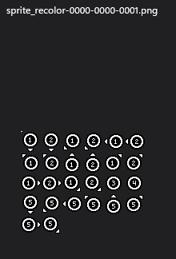
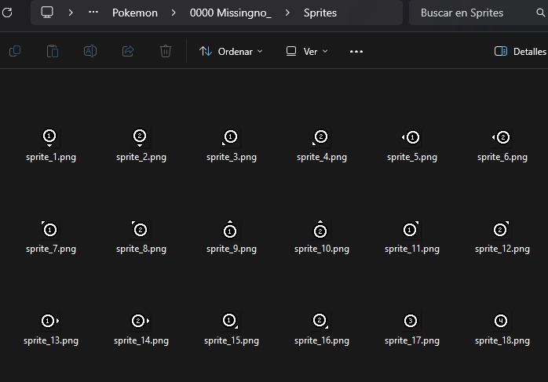
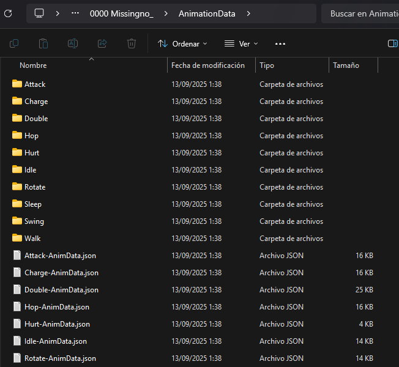
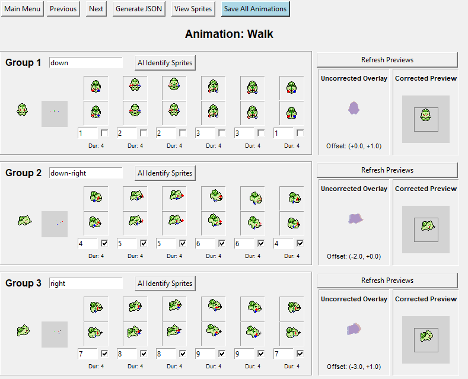
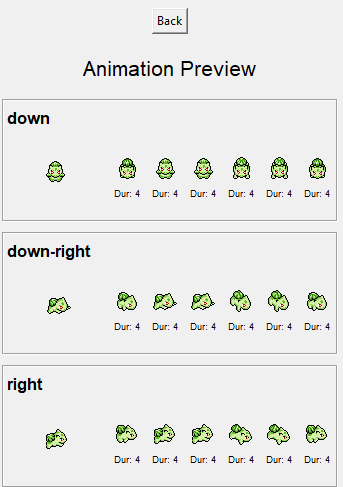

# PMD Sprite & Animation Manager

## Overview

This is a comprehensive toolset for working with Pokémon Mystery Dungeon (PMD) sprites, designed to streamline the entire pipeline from raw assets to game-ready animations. Built for assets from [PMD Collab](https://sprites.pmdcollab.org/), this manager provides two core workflows:

1.  **Single Project Editor**: A detailed, hands-on interface for splitting a master spritesheet and meticulously editing, correcting, and previewing animations for a single character.
2.  **Batch Processor**: A powerful, automated system for processing an entire directory of characters at once, capable of generating sprites and optimized animation data with minimal user intervention.

The manager automates tedious tasks like parsing XML files, matching sprites to animation frames, and calculating positional offsets, allowing creators to focus on building high-quality, efficient animations.

---

## Features

-  workflow **Two Distinct Workflows**:
  - **Single Project Mode**: For in-depth editing and fine-tuning.
  - **Batch Mode**: For processing entire collections of characters automatically.

- 🖼️ **Advanced Animation Editor**:
  - Load and visualize original animations directly from PMD Collab's `AnimData.xml`.
  - **AI-Powered Sprite Matching**: Automatically identify and assign your library sprites to animation frames.
  - **Live Previews**:
    - **Original Animation**: The source animation for reference.
    - **Corrected Result**: A real-time preview of your custom animation with automatic position correction.
    - **Uncorrected Overlay**: A diagnostic view (red/blue) showing the offset between the original sprite and your custom one.
  - **Automatic Offset Correction**: Calculates the center of mass for original and custom sprites to ensure your animations remain centered and smooth.

- ⚙️ **Powerful Batch Processing**:
  - **Batch Sprite Generation**: Process spritesheets for dozens of characters in a guided, step-by-step interface.
  - **Batch Animation Generation**: Automatically generate optimized JSON animation data for all characters in a folder. This process runs in the background and is fully unattended.
  - **Batch Animation Previewer**: Quickly load and preview the final, optimized animations for any character in your collection.

- 📦 **Optimized Asset Export**:
  - Generates lightweight, game-ready JSON files that reference a minimal set of required sprites.
  - Creates 8-bit indexed PNGs for optimized file size and performance.
  - Automatically handles mirrored sprites to reduce redundant files.

- 🚀 **Helper Scripts**:
  - **Asset Generator**: A command-line script (`Scripts/generate_assets.py`) to automate the tedious initial setup of downloading, unzipping, and organizing files from PMD Collab.
  - **Common Asset Exporter**: A script (`Scripts/export_assets.py`) to find animations common to all characters and export them into a clean, distributable package.

---

## Getting Started

### Method 1: Automated Setup (Recommended)

Use the included helper script for a fast, automated setup.

1.  **Download Assets**: Go to [PMD Collab](https://sprites.pmdcollab.org/) and download the **"all sprites"** `.zip` file for every character you want to process. Place all the zip files in the `Scripts` directory.
2.  **Create `names.txt`**: Inside the `Scripts` directory, create a file named `names.txt`. List the exact name of each character's folder you want to create, one per line (e.g., `Pikachu`, `Bulbasaur`).
3.  **Run the Script**: Navigate to the `Scripts` directory and run `generate_assets.py`.
    ```bash
    cd Scripts
    python generate_assets.py
    ```
4.  **Follow the Menu**: The script will guide you through:
    1.  Creating all the character folders.
    2.  Unzipping the asset files into the correct `Animations` subfolder for each character.
    3.  Cleaning up the leftover `.zip` files.

### Method 2: Manual Setup

1.  **Obtain Files**: Visit [PMD Collab](https://sprites.pmdcollab.org/) and download for each Pokémon:
    - The **master sprite sheet PNG**.
    - The **"all sprites"** `.zip` file containing animation data.
2.  **Create Folder Structure**: For each character, create a project folder. Place the master spritesheet inside, and unzip the "all sprites" download into a subfolder named `Animations`.

    ```bash
    YourPokemonFolder/
    ├── YourPokemon.png       # The master spritesheet file
    └── Animations/
        ├── AnimData.xml      # From the unzipped "all sprites"
        ├── [AnimationName]-Anim.png
        └── ...               # Other files from the ZIP
    ```

---

## Usage Guide

### For Windows Users
A pre-built executable is available in the **Releases** section of the repository. Simply download `PMDSpriteManager.exe` and run it—no Python installation is needed.

### For Other Platforms
1.  **Run the Program**:
    ```bash
    python main.py
    ```
2.  **Choose Your Workflow**: The application starts with a choice between a single project or batch processing.

    

    *The initial screen where you choose to work on a single project or batch process multiple folders.*

---

### Workflow 1: Single Project Editor

Select a single character folder (e.g., `PikachuProject`) to access the main menu.

-   **Process Spritesheet**: Loads the master spritesheet. You'll provide the grid dimensions to split it into a library of individual sprites, which are saved to a new `Sprites/` folder.
-   **View/Edit Animations**: Opens the main animation editor. Here you can use the AI identifier, manually assign sprites, and preview your changes in real-time.
-   **Preview Optimized Animations**: Loads the final, generated JSON and sprites for a clean preview of how the animation will look in-game.

---

### Workflow 2: Batch Processor

Select a parent folder containing multiple character project folders.



*The task selection menu for batch operations.*

-   **Generate Sprites**: A guided tool that iterates through each project folder, displays its spritesheet, and prompts you for the grid size to process them all efficiently.
-   **Generate Optimized Animations**: A fully automated, one-click process that generates JSON data for every animation of every character in the parent folder.
-   **Preview Optimized Animations**: A selection screen to quickly browse all characters and launch a preview of their final animations.



*Quickly select any project in the batch to preview its final animations.*

---

## User Interface Walkthrough

### From Spritesheet to Asset Library

The tool simplifies the conversion of raw assets into an organized, game-ready structure.



*1. The process starts with the master spritesheet from PMD Collab, containing all character sprites in a single image.*



*2. After processing, the tool generates a clean `Sprites/` folder with each sprite as an individual, numbered PNG file, forming your asset library.*



*3. The final output is the `AnimationData` folder. It contains the optimized JSON files and sub-folders with only the necessary 8-bit PNG sprites required for each animation.*

### The Animation Editor
This is the core of the single-project workflow. It provides all the tools and visual feedback needed to build animations.



*The main Animation Editor, showing (from left to right): original animation, offset/corrected previews, and the detailed frame-by-frame inputs.*

### Final Animation Preview
Whether in single or batch mode, the final previewer provides a clean, large view of the generated animation, running smoothly with all corrections applied.



*The final preview screen, which plays the optimized animation as it would appear in-game.*

---

## How It Works

-   **Image Processing**: Uses **Pillow (PIL)** for all image manipulation, including splitting spritesheets, handling transparency, and creating optimized 8-bit PNGs.
-   **Sprite Matching**: Uses **NumPy** for fast, exact pixel-matching of sprites (both normal and mirrored) to automatically assign them to animation frames.
-   **Animation System**:
    -   Parses PMD Collab's XML animation data to extract frame data, durations, and anchor points.
    -   Calculates a **center of mass** for sprite visuals to compute positional offsets, ensuring custom sprites move as fluidly as the originals.
    -   Uses **Tkinter** for the GUI and real-time animation rendering.
-   **Batch Operations**: The animation generation process is multi-threaded, allowing the UI to remain responsive while assets are processed in the background.

---

## Requirements

-   **For Windows**: Download the executable from the **Releases** section.
-   **For Other Platforms**:
    -   Python 3.7+
    -   Required Libraries:
        ```bash
        pip install pillow numpy
        ```
    -   Included with Python: `tkinter`, `xml.etree.ElementTree`.

---

## Contributing

Contributions are welcome! Please open an issue for:
-   Bug reports
-   Feature requests
-   Compatibility issues with new PMD Collab formats

---

## License

MIT License. See the `LICENSE` file for details.

---

## Acknowledgments

-   All sprite and animation assets are provided by the incredible team at [PMD Collab](https://sprites.pmdcollab.org/).
-   Pokémon Mystery Dungeon © Nintendo/Creatures Inc./GAME FREAK inc.
-   This tool was developed by fans, for fans.

:)