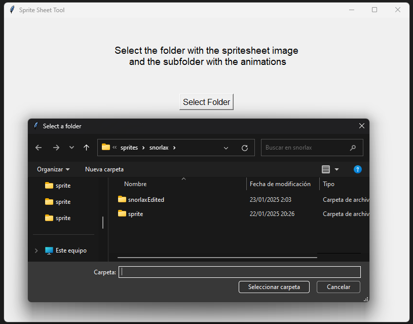
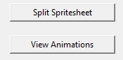
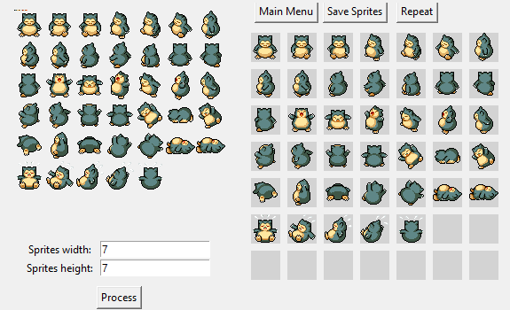
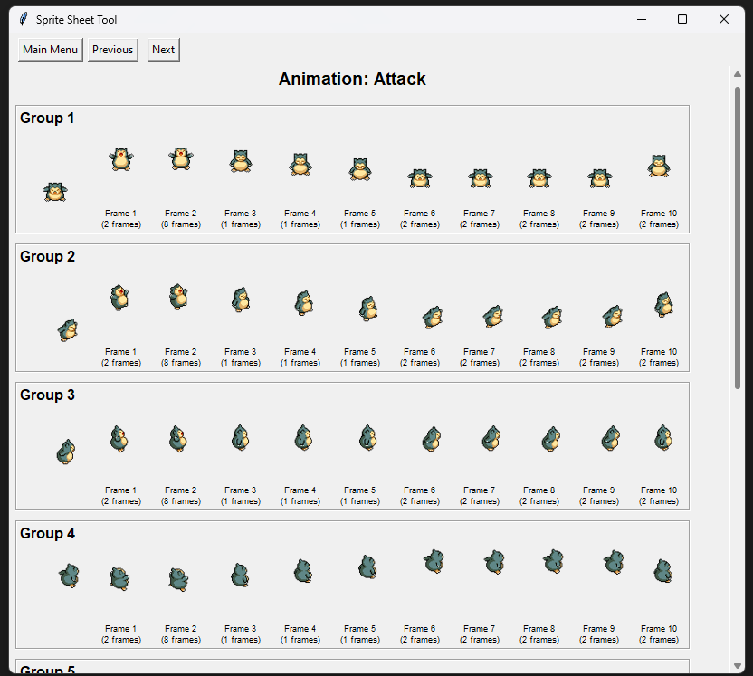

# PMD Sprite Tool

## Overview

This tool is designed to simplify working with Pokémon Mystery Dungeon (PMD) sprites from [PMD Collab](https://sprites.pmdcollab.org/). It provides two main functionalities:
1. **Sprite Sheet Splitting**: Divide a sprite sheet into individual sprites
2. **Animation Viewer**: Visualize animations with frame timing and groupings

The tool automatically processes sprite sheets and animation data from PMD Collab, eliminating manual inspection of XML files while preserving transparency and animation timing information.

---

## Features

- 🖼️ **Sprite Sheet Division**:
  - Split sprite sheets into individual sprites with transparency
  - Custom grid division (specify columns/rows)
  - Preview sprites with light gray background
  - Save sprites to organized folder structure

- 🎬 **Animation Viewer**:
  - Load animations from PMD Collab's `AnimData.xml`
  - Real-time animation preview with accurate frame timing
  - Display frame groupings and durations
  - Navigate between different animations

---

## Getting Started

### 1. Obtain Required Files
1. Visit [PMD Collab](https://sprites.pmdcollab.org/)
2. Select a Pokémon and download:
   - **"Recolor sprites"** (sprite sheet PNG)
   - **"all sprites"** (ZIP file with animation data)

### 2. Create Folder Structure
```bash
YourFolder/
├── RecolorSprites.png    # Renamed "Recolor sprites" file
└── sprite/
    ├── AnimData.xml      # From unzipped "all sprites"
    ├── [AnimationName]-Anim.png
    └── ...               # Other files from the ZIP
```

### Example Structure
```bash
PMD_Sprites/
├── RecolorSprites.png
└── sprite/
    ├── AnimData.xml
    ├── Walk-Anim.png
    ├── Idle-Anim.png
    └── Attack-Anim.png
```

---

## Usage

### For Windows Users
If you're on Windows, you can use the pre-built executable available in the [Releases section](https://github.com/netraular/PMDSpriteManager/releases). Download `PMDSpriteManager.exe` and run it directly—no Python installation required!

### For Other Platforms
1. **Run the Program**:
   ```bash
   python main.py
   ```

2. **Select Your Folder**:
   - Choose the folder containing your `RecolorSprites.png` and `sprite` subfolder

3. **Main Menu Options**:
   - **Split Sprite Sheet**:
     1. Enter number of horizontal and vertical sprites
     2. Preview divided sprites
     3. Save to automatically created `[FolderName]Edited` subfolder
     4. Use "Repeat" to try different grid sizes

   - **View Animations**:
     1. Browse animations using Previous/Next buttons
     2. View real-time animation previews
     3. See frame durations and groupings
     4. Scroll through all animation frames

---

## User Interface Walkthrough

### 1. Folder Selection Screen
The tool starts by prompting the user to select a folder containing the sprite sheet and animation data. This is the initial screen where users begin their workflow.

  
*Caption: The initial screen where users select the folder containing the sprite sheet and animation data.*

---

### 2. Main Menu
After selecting the folder, the main menu is displayed. From here, users can choose between splitting sprite sheets or viewing animations.

  
*Caption: The main menu with options to split sprite sheets or view animations.*

---

### 3. Sprite Sheet Splitting
In the sprite sheet splitting mode, users can input the number of sprites horizontally and vertically. The tool then processes the sprite sheet and displays the individual sprites in a grid.

#### Example of a Divided Sprite Sheet
  
*Caption: A sprite sheet divided into individual sprites, displayed in a grid with a light gray background.*

---

### 4. Animation Viewer
The animation viewer allows users to load and preview animations from the `AnimData.xml` file. It displays frame groupings, durations, and a real-time animation preview.

#### Animation Viewer in Action
  
*Caption: The animation viewer displaying frame groupings, durations, and a real-time animation preview.*

---

## How It Works

- **Sprite Processing**:
  - Uses Pillow (PIL) for image manipulation
  - Handles transparency through alpha channels
  - Automatic background addition for previews

- **Animation System**:
  - Parses PMD Collab's XML animation data
  - Calculates frame timing from game ticks (30 ticks/second)
  - Dynamically loads animation strips
  - Uses Tkinter for real-time animation rendering

---

## Requirements

- **For Windows**: Download the executable from the [Releases section](https://github.com/netraular/PMDSpriteManager/releases).
- **For Other Platforms**:
  - Python 3.7+
  - Libraries:
    ```bash
    pip install pillow
    ```
  - Included in Python Standard Library:
    - `tkinter` (for GUI)
    - `xml.etree.ElementTree` (for parsing animation data)

---

## Contributing

Contributions are welcome! Please open an issue for:
- Bug reports
- Feature requests
- Compatibility issues with new PMD Collab formats

---

## License

MIT License. See [LICENSE](LICENSE) for details.

---

## Acknowledgments

- Sprites and animation data provided by [PMD Collab](https://sprites.pmdcollab.org/)
- Pokémon Mystery Dungeon © Nintendo/Creatures Inc./GAME FREAK inc.
- Developed for fans by PMD enthusiasts

---

**Happy spriting!** 🐾⚡️