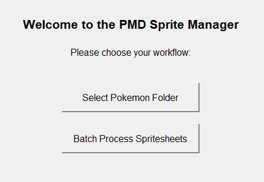
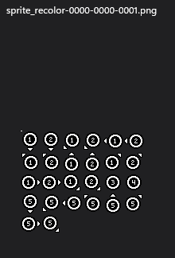
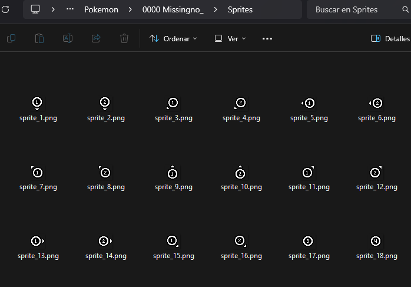
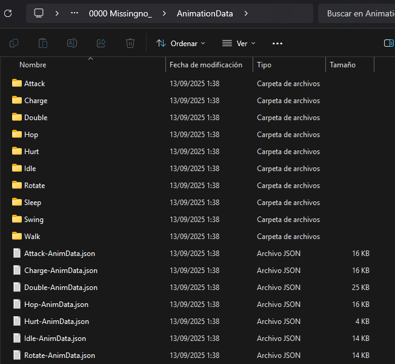
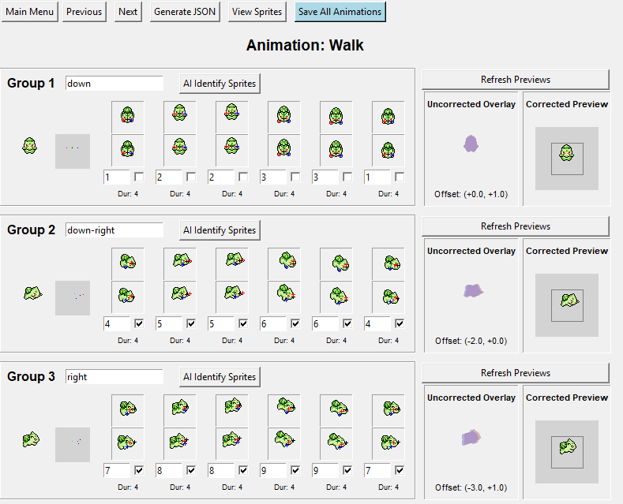
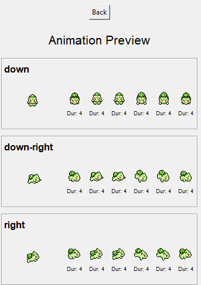

# PMD Sprite & Animation Manager

## Overview

This is a comprehensive toolset for working with Pokémon Mystery Dungeon (PMD) sprites, designed to streamline the entire pipeline from raw assets to game-ready **isometric animations**. Built for assets from [PMD Collab](https://sprites.pmdcollab.org/), this manager provides two core workflows integrated into a single powerful application:

1.  **Single Project Editor**: A detailed, hands-on interface for splitting a master spritesheet and meticulously editing, correcting, and previewing animations for a single character, with a strong focus on generating correct isometric render data.
2.  **Batch Processor**: A powerful, automated system for processing an entire directory of characters at once. It can handle everything from initial asset setup and sprite generation to exporting final, optimized animation packages in both 1x and 2x resolutions.

The manager automates tedious tasks like parsing XML files, matching sprites to animation frames, and calculating complex positional offsets, allowing creators to focus on building high-quality, efficient animations for their projects.

---

## Features

-   **Two Distinct Workflows**:
    -   **Single Project Mode**: For in-depth editing and fine-tuning of individual characters.
    -   **Batch Mode**: For processing entire collections of characters automatically through a task-based interface.

-   🖼️ **Advanced Animation Editor**:
    -   Load and visualize original animations directly from PMD Collab's `AnimData.xml`.
    -   **AI-Powered Sprite Matching**: Automatically identify and assign your library sprites to animation frames.
    -   **Multiple Live Previews**:
        -   **Originals**: View the source character, shadow, and offset frames.
        -   **Corrected**: See your custom animation with automatic position correction applied.
        -   **Overlay**: A diagnostic view (red/blue) showing the displacement between original and custom sprites.
        -   **Isometric Preview**: A final, in-game preview on an isometric grid, showing world displacement and final render offsets.

-   ⚙️ **Powerful Batch Processing**:
    -   **Integrated Asset Generator**: A guided UI workflow to create project folders from a `names.txt` file, uncompress ZIPs, and clean up, replacing previous standalone scripts.
    -   **Batch Sprite Generation**: Process spritesheets for dozens of characters in a guided, step-by-step interface.
    -   **Batch Animation Generation**: A fully automated, multi-threaded process to generate optimized JSON data for every animation of every character.
    -   **Batch Asset Exporter (1x & 2x)**: Export clean, distributable `output` and `output x2` packages containing only the animations and sprites common to all characters. The 2x export performs a pixel-perfect upscale of all assets and data.
    -   **Batch Shadow Generator**: Automatically find and copy the correct base shadow sprite into the final output folders.

-   📐 **Isometric Rendering Core**:
    -   Calculates `sprite_anchor_offset` (the vector from the shadow's center to the character's anchor point).
    -   Calculates per-frame `render_offset` (the final vector from the world origin to the sprite's top-left corner).
    -   This data is essential for accurately positioning sprites within an isometric game engine.

-   📦 **Optimized Asset Export**:
    -   Generates lightweight, game-ready JSON files that reference a minimal set of required sprites.
    -   Creates 8-bit indexed PNGs for optimized file size and performance.
    -   Automatically handles mirrored sprites to reduce redundant files.

-   🚀 **Integrated Previewers**:
    -   **All Animations Preview**: View all generated animations for a single character in a scrollable grid.
    -   **Batch Previewer**: After exporting, quickly browse any character in the `output` or `output x2` folders and see their final animations side-by-side.

---

## Getting Started

### Automated Setup via the GUI (Recommended)

The tool now includes a built-in workflow to automate the initial, tedious setup of downloading and organizing files.

1.  **Download Assets**: Go to [PMD Collab](https://sprites.pmdcollab.org/) and download the **"all sprites"** `.zip` file for every character you want to process. Place all the zip files in a single parent directory (e.g., `MyPMDProjects`).
2.  **Create `names.txt`**: Inside that same parent directory, create a file named `names.txt`. List the exact name of each character, one per line (e.g., `Pikachu`, `Bulbasaur`). These names must match the folders that will be created.
3.  **Run the Tool**: Launch the application and choose the **"Batch Process Spritesheets"** workflow, selecting your parent directory.
4.  **Use the Asset Generator**: From the batch task menu, select **"Generate Assets"**. Follow the on-screen steps:
    1.  Click **"1. Create Folders from names.txt"**.
    2.  Click **"2. Uncompress ZIPs"**. This will automatically find the zips and extract them into the correct `Animations` subfolder for each character.
    3.  Click **"3. Cleanup ZIP files"** to delete the archives.

Your project structure is now ready for batch processing.

### Manual Setup

1.  **Obtain Files**: Visit [PMD Collab](https://sprites.pmdcollab.org/) and download for each Pokémon:
    -   The **master sprite sheet PNG**.
    -   The **"all sprites"** `.zip` file containing animation data.
2.  **Create Folder Structure**: For each character, create a project folder. Place the master spritesheet inside, and unzip the "all sprites" download into a subfolder named `Animations`.

    ```
    YourPokemonFolder/
    ├── YourPokemon.png       # The master spritesheet file
    └── Animations/
        ├── AnimData.xml      # From the unzipped "all sprites"
        ├── [AnimationName]-Anim.png
        └── ...               # Other files from the ZIP
    ```

### Command-line bulk download

To fetch many Pokémon at once without the GUI, use the headless downloader. It
replicates the in-app "Prepare Data" + "Download Sprites" steps and produces a
`downloads/` layout compatible with the Batch tool ("Select Parent Folder").

```bash
# First 151 Pokémon -> ./pmd_projects/downloads/<id Name>/Animations/
python Scripts/download_pmd_sprites.py --start 1 --end 151 --out pmd_projects
```

### Firmware / Web Export (hibitomo overworld format)

Converts each character's PMD **Walk** animation into the single-sheet overworld
format shared by **both** the hibitomo web content-editor and the
`lv_port_pc_vscode` firmware (`graphics/species/pokemon`): one PNG per creature, an
**8×4** grid whose **cell size is per-species** — the creature's content bounding
box (union over all its walk frames) magnified **2×** (nearest-neighbour). Sheets
are therefore variable-sized (and may be non-square) from one creature to the next,
so no creature is ever clipped and small/large creatures keep their natural relative
size. Each **row is a direction** (0=DOWN, 1=LEFT, 2=RIGHT, 3=UP) and each **column
is a walk frame** — the creature's **full native walk cycle** (3–12 frames)
resampled to the fixed **8** columns, so the complete movement is preserved rather
than the old 2-frame approximation. Because every frame is cropped to the same
shared box, there is **no dead margin** around the sprite and the walk bounce / jumps
are preserved (higher frames float up by exactly their native amount). Both
consumers derive the cell pixel size from the sheet dimensions and grid (the web
normalizes to a fixed display box; the firmware draws at native size, bottom-anchored
to the tile), so a variable per-creature cell size just works. A matching
**data-driven** `_layout.json`
(`style: explicit`, listing every per-direction walk cell) is written next to the
sheets, so no packing knowledge is hard-coded on either consumer — both read the
walk cells straight from the JSON.

> The column count is configurable (`--frames`, default **8** = the firmware
> `PET_MAX_WALK_FRAMES`). Creatures with fewer native frames repeat within the
> cycle; the handful with more are evenly subsampled. The per-sprite magnification
> is configurable too (`--scale`, default **2**), and sets the cell size (content
> bbox × scale).

The web and firmware sheets are byte-identical; only the folder each project
stores them in differs. The exporter therefore also stages two **copy-ready
subtrees** so you can drop them straight into the right repo root:

```
firmware_output/
├── 001.png … 151.png        # flat sheets + _layout.json (sample)
├── _layout.json
├── firmware/shared/services/pet/assets/graphics/species/pokemon/…   # -> lv_port_pc_vscode
└── web/local-content/projects/default/shared/services/pet/assets/graphics/species/pokemon/…  # -> hibitomo-content-editor
```

> **Art note:** these sheets use **PMD Collab** source art, which is a different
> style from the HeartGold overworld rips currently shipped in the repos. Copying
> them in replaces the creature art (in the correct packing) — that is the intended
> use of this exporter, not a bug.

-   **CLI**: `python Scripts/export_firmware_sheets.py --downloads pmd_projects/downloads --out firmware_output`
    -   `--target firmware` / `--target web` / `--target both` (default) / `--target none` (flat only)
    -   `--frames 8` walk frames per direction / sheet columns · `--scale 2` sprite magnification (also sets the per-species cell size = content bbox × scale)
-   **GUI**: Batch tool → **"Firmware / Web Export (1 sheet 8×4)"** (writes `firmware_output/` next to `downloads/`, with the `firmware/` and `web/` subtrees).

The conversion logic lives in `src/core/firmware_exporter.py` (Pillow-only, GUI-agnostic).

---

## Usage Guide

### For Windows Users
A pre-built executable is available in the **Releases** section of the repository. Simply download `PMDSpriteManager.exe` and run it—no Python installation is needed.

### For Other Platforms
1.  **Run the Program**:
    ```bash
    python main.py
    ```
2.  **Choose Your Workflow**: The application starts with a choice between a single project or batch processing.

    

    *The initial screen where you choose to work on a single project or batch process multiple folders.*

---

### Workflow 1: Single Project Editor

Select a single character folder (e.g., `PikachuProject`) to access the main menu.

-   **Process Spritesheet**: Loads the master spritesheet. You'll provide the grid dimensions to split it into a library of individual sprites, which are saved to a new `Sprites/` folder.
-   **Edit Animations**: Opens the main animation editor. Here you can use the AI identifier, manually assign sprites, and preview your changes in real-time across multiple diagnostic and isometric views.
-   **All Animations Preview**: Loads the final, generated JSON and sprites for a clean preview of how all animations for that character will look in-game.

---

### Workflow 2: Batch Processor

Select a parent folder containing multiple character project folders to access the task menu.

-   **Generate Assets**: The integrated setup tool described in "Getting Started".
-   **Generate Sprites**: A guided tool that iterates through each project folder, displays its spritesheet, and prompts you for the grid size to process them all efficiently.
-   **Generate Optimized Animations**: A fully automated, one-click process that generates JSON data for every animation of every character in the parent folder.
-   **Export Final Assets (1x & x2)**: Creates clean `output` and `output x2` folders containing only the animations and assets common to all processed characters, ready for distribution or game integration.
-   **Preview Optimized Animations**: A selection screen to quickly browse all characters in your `output` folders and launch a preview of their final animations.

---

## User Interface Walkthrough

### From Spritesheet to Asset Library

The tool simplifies the conversion of raw assets into an organized, game-ready structure.



*1. The process starts with the master spritesheet from PMD Collab, containing all character sprites in a single image.*



*2. After processing, the tool generates a clean `Sprites/` folder with each sprite as an individual, numbered PNG file, forming your asset library.*



*3. The final output is the `AnimationData` folder. It contains the optimized JSON files and sub-folders with only the necessary 8-bit PNG sprites required for each animation.*

### The Animation Editor
This is the core of the single-project workflow. It provides all the tools and visual feedback needed to build and verify isometric animations.



*The main Animation Editor, showing (from left to right): original animation previews, the detailed frame-by-frame sprite editor, and generated previews including the final isometric result.*

### Final Animation Preview
Whether in single or batch mode, the final previewer provides a clean, large view of the generated animation, running smoothly with all corrections applied on an isometric grid.



*The final preview screen, which plays the optimized animation as it would appear in-game, complete with render offset data.*

---

## How It Works

-   **Image Processing**: Uses **Pillow (PIL)** for all image manipulation, including splitting spritesheets, handling transparency, and creating optimized 8-bit PNGs.
-   **Sprite Matching**: Uses **NumPy** for fast, exact pixel-matching of sprites (both normal and mirrored) to automatically assign them to animation frames.
-   **Animation System**:
    -   Parses PMD Collab's XML animation data to extract frame data, durations, and anchor points.
    -   Calculates a **visual bottom-center** for sprites to compute positional corrections, ensuring custom sprites move as fluidly as the originals.
    -   Calculates all necessary vectors for **isometric rendering**, including static anchor offsets and per-frame render offsets.
    -   Uses **Tkinter** for the GUI and real-time animation rendering.
-   **Batch Operations**: The animation generation and export processes are **multi-threaded** using Python's `concurrent.futures`, allowing the UI to remain responsive while assets are processed in the background.

---

## Requirements

-   **For Windows**: Download the executable from the **Releases** section.
-   **For Other Platforms**:
    -   Python 3.7+
    -   Required Libraries:
        ```bash
        pip install pillow numpy
        ```
    -   Included with Python: `tkinter`, `xml.etree.ElementTree`.

---

## Contributing

Contributions are welcome! Please open an issue for:
-   Bug reports
-   Feature requests
-   Compatibility issues with new PMD Collab formats

---

## License

MIT License. See the `LICENSE` file for details.

---

## Acknowledgments

-   All sprite and animation assets are provided by the incredible team at [PMD Collab](https://sprites.pmdcollab.org/).
-   Pokémon Mystery Dungeon © Nintendo/Creatures Inc./GAME FREAK inc.
-   This tool was developed by fans, for fans.